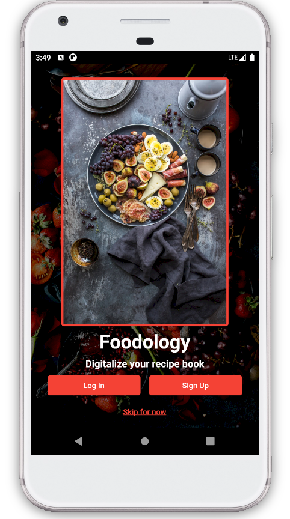
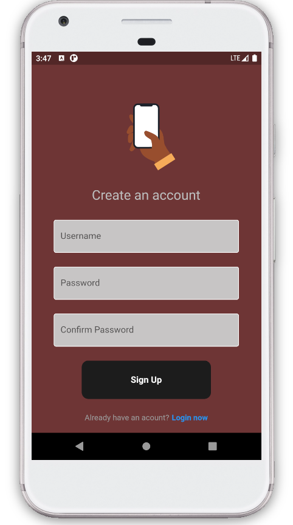
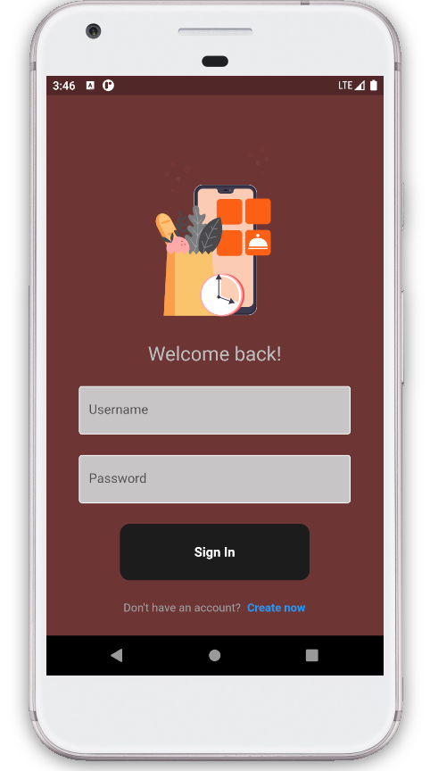
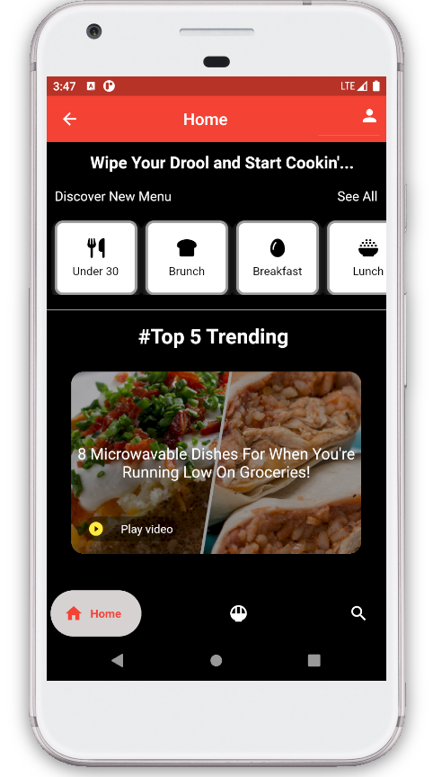
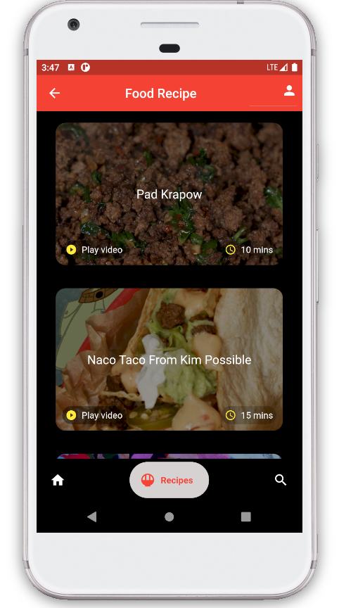
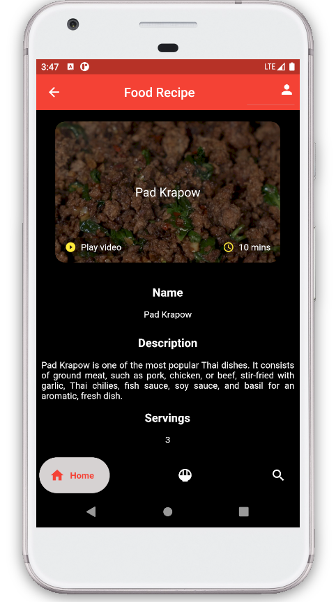
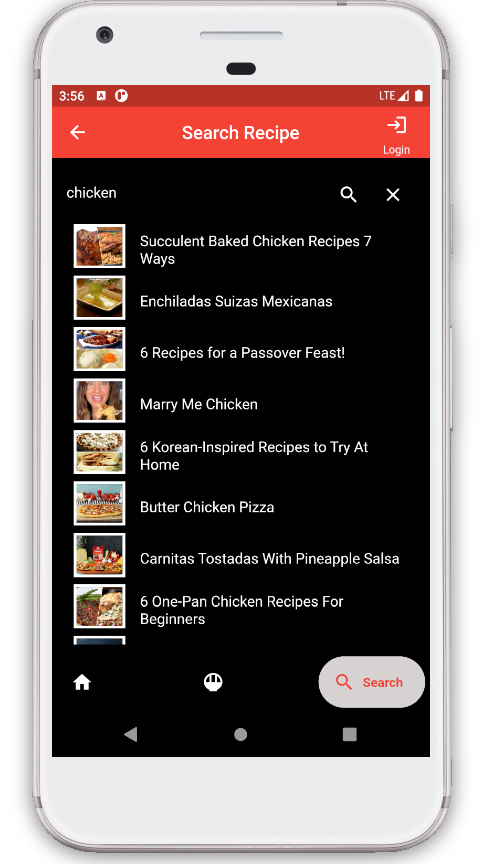
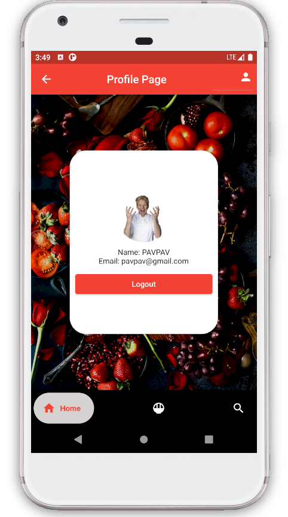

#Name of the application:
Foodology

#Features and Functionality
The app has the following features:

Browse recipes: Users can browse through a list recipes view details such as name, description, number of servings, ingredient and instruction.

Search recipes: Users can search for their favourite food 

Filter recipes: Users can filter foods by categories of meals.

User authentication: Users can create an account and log in to the app.

#Screenshot

